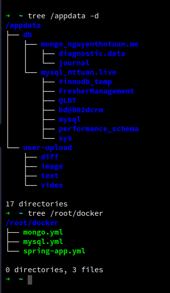

# EASY DOWNLOAD SH FOLDER:

```shell
sudo apt-get install subversion -y && 
svn export https://github.com/ngthotuan/note-script/trunk/sh
```

# INSTALL ZSH
```shell
sudo apt-get install git -y &&
sudo apt-get install zsh -y &&
sudo curl -L http://install.ohmyz.sh | sh &&
chsh -s $(which zsh) &&
git clone https://github.com/zsh-users/zsh-autosuggestions.git ~/.oh-my-zsh/custom/plugins/zsh-autosuggestions &&
echo 'source ~/.oh-my-zsh/custom/plugins/zsh-autosuggestions/zsh-autosuggestions.zsh' >> ~/.zshrc &&
echo 'alias dpsa="docker ps -a"' >> ~/.zshrc &&
echo 'alias di="docker images"' >> ~/.zshrc &&
echo 'alias de="docker exec -it"' >> ~/.zshrc &&
echo 'alias dc="docker compose"' >> ~/.zshrc &&
echo 'alias dcf="docker compose --file"' >> ~/.zshrc &&
echo 'alias dcu="docker compose up -d"' >> ~/.zshrc &&
echo 'alias dcub="docker compose up -d --build"' >> ~/.zshrc &&
echo 'alias dcd="docker compose down"' >> ~/.zshrc &&
echo 'alias drmi="docker images -a | grep none | awk '{ print $3; }' | xargs docker rmi --force"' >> ~/.zshrc

```
# INSTALL NodeJS
```shell
curl -sL https://deb.nodesource.com/setup_lts.x | sudo -E bash - &&
sudo apt update &&
sudo apt-get install -y nodejs
```
> See more: https://www.digitalocean.com/community/tutorials/how-to-set-up-a-node-js-application-for-production-on-ubuntu-16-04

# INSTALL PM2 - NGINX
```shell
sudo npm install -g pm2 &&
pm2 startup systemd &&
sudo apt install -y nginx
```

# UFW
```shell
ufw enable
ufw allow ssh
ufw allow http
ufw allow https
sudo systemctl stop nginx
sudo systemctl start nginx
```

# INSTALL DOCKER - DOCKER-COMPOSE
```shell
sudo apt update &&
sudo apt install -y apt-transport-https ca-certificates curl software-properties-common &&
curl -fsSL https://download.docker.com/linux/ubuntu/gpg | sudo apt-key add - &&
sudo add-apt-repository "deb [arch=amd64] https://download.docker.com/linux/ubuntu bionic stable" &&
sudo apt update &&
sudo apt install -y docker-ce &&
sudo usermod -aG docker ${USER} &&
su - ${USER} &&
id -nG
```
Add user to docker: sudo usermod -aG docker 'username'

> See more docker: https://www.digitalocean.com/community/tutorials/how-to-install-and-use-docker-on-ubuntu-18-04#step-1-%E2%80%94-installing-docker

> See more docker-compose: https://www.digitalocean.com/community/tutorials/how-to-install-and-use-docker-compose-on-ubuntu-20-04

# Backup and restore data
## 1. Backup & restore host to host

### 1.1 Create ssh key from _current host_:
```shell
ssh-keygen
'Enter Enter Enter'
```
```shell
cat ~/.ssh/id_rsa.pub
'Copy ssh-rsa...'
```
### 1.2 Paste public key to _target host_:
```shell
 nano ~/.ssh/authorized_keys
 'Paste ssh to end file'
```
### 1.3 From _current host_ run script copy:

```shell
 rsync -avzp CURRENT_HOST_FOLDER -e ssh TARGET_HOST:TARGET_FOLDER
```
For example:
```shell
 rsync -avzp /appdata/ -e ssh 139.59.254.47:/appdata/
 rsync --exclude digitalocean --exclude containerd -avzp /opt -e ssh 139.59.231.20:/

```
More information please see [here](https://www.tecmint.com/rsync-local-remote-file-synchronization-commands/)
### 1.4 Restore db,...etc


Assume copy docker file to /root/docker folder
```shell
docker-compose --file /root/docker/mongo.yml up -d
docker-compose --file /root/docker/mysql.yml up -d
```
